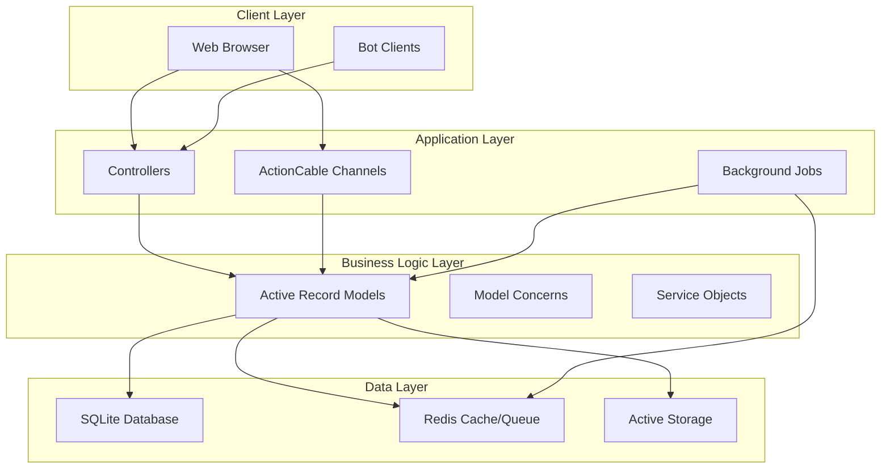
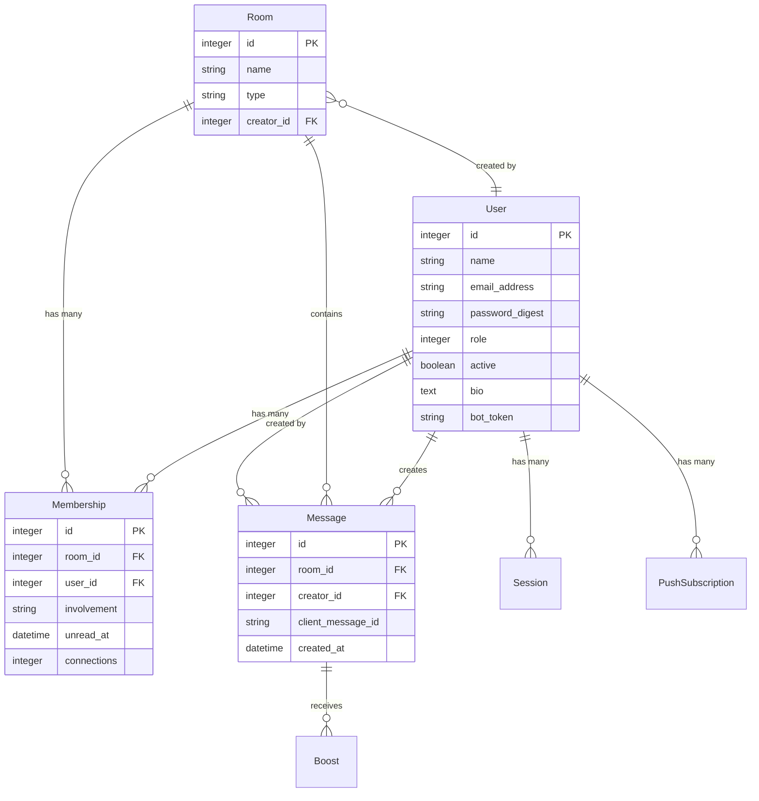
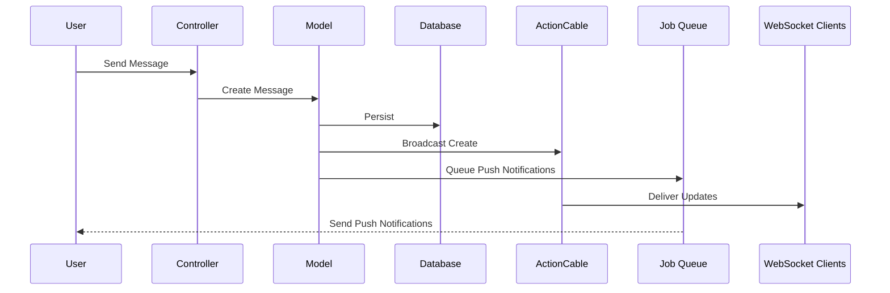
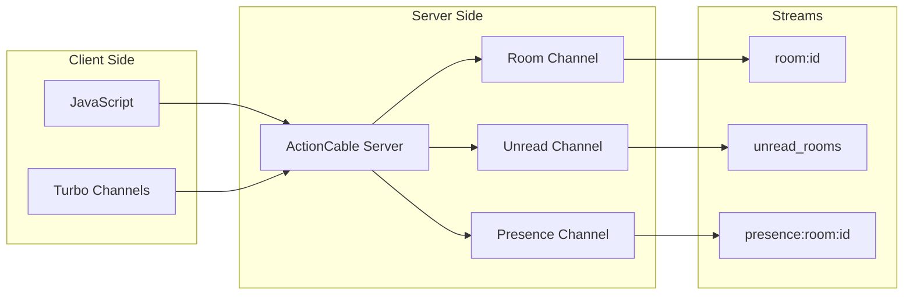
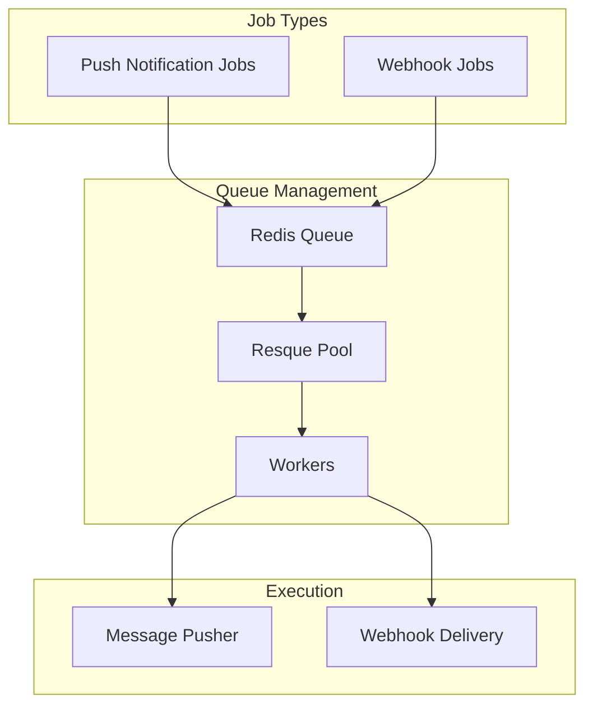
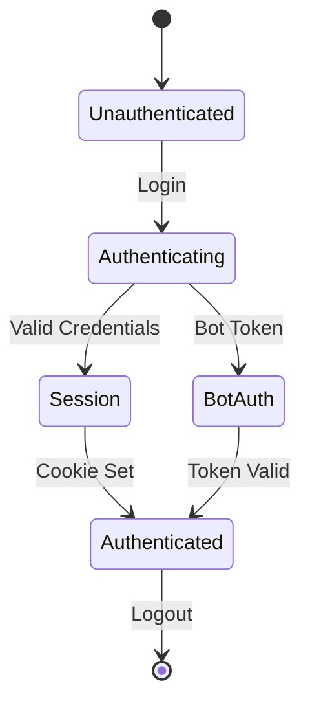

# Backend Architecture Documentation

## Table of Contents
1. [Architecture Overview](#architecture-overview)
2. [Data Model & Database Schema](#data-model--database-schema)
3. [Key Abstractions & Design Patterns](#key-abstractions--design-patterns)
4. [Data Flow Architecture](#data-flow-architecture)
5. [Real-time Communication Architecture](#real-time-communication-architecture)
6. [Background Job Processing](#background-job-processing)
7. [Authentication & Authorization](#authentication--authorization)
8. [Project Structure](#project-structure)
9. [Critical Analysis](#critical-analysis)

## Architecture Overview

When you first dive into Campfire's codebase, you'll notice it's refreshingly straightforward—this isn't your typical over-engineered enterprise application. Built on Rails 8.1's edge version, Campfire embraces the framework's "convention over configuration" philosophy while adding just enough modern features to make real-time chat feel seamless.

The architecture is deliberately monolithic, and that's actually one of its strengths. In an era where microservices are often adopted prematurely, Campfire demonstrates that a well-structured monolith can handle sophisticated real-time features without the operational complexity of distributed systems. The application combines traditional request-response patterns with WebSocket connections, background job processing, and push notifications—all running from a single Rails application.

What makes this approach particularly interesting is how it aligns with the product's deployment model. Campfire is designed as a single-tenant application meant to run on a single machine (often in a Docker container), which means the architects could make assumptions that wouldn't work for a multi-tenant SaaS product. This constraint became a feature, allowing for simpler database choices (SQLite even in production!) and eliminating entire categories of distributed systems problems.

The backend follows a **layered architecture approach** that will feel familiar to Rails developers but with some thoughtful modifications:



### Technology Stack Highlights

The technology choices here tell a story about pragmatism over trend-chasing. Let's walk through the key decisions:

**SQLite3 for everything** might raise eyebrows if you're used to PostgreSQL or MySQL in production, but it's a brilliant choice for Campfire's use case. Since each deployment serves a single organization on a single machine, SQLite's limitations (concurrent writes, horizontal scaling) simply don't apply. What you get instead is zero operational overhead—no database server to manage, no connection pools to tune, just a file on disk that's trivially easy to backup.

**Redis** serves double duty as both a cache store and job queue backend. It's the only additional service the application requires, and it earns its keep by powering the real-time features. ActionCable uses Redis for pubsub, Resque uses it for job queuing, and the application uses it for caching hot data like presence information.

**Hotwire (Turbo + Stimulus)** represents a philosophical stance: you don't need a heavy JavaScript framework to build interactive applications. By sending HTML over the wire and using targeted DOM updates, Campfire achieves snappy, app-like interactions without the complexity of managing client-side state. This is particularly evident in how messages appear instantly in the chat without full page refreshes.

**Resque with resque-pool** might seem old-school compared to Sidekiq, but it's rock-solid for Campfire's needs. The resque-pool manager ensures worker processes are always running, and the simple Redis-backed queue means one less moving part in the infrastructure.

**Import maps over Webpack** is another simplification win. Instead of complex build pipelines and node_modules folders, JavaScript dependencies are managed through native browser imports. It's a bet on web standards that's paying off in reduced complexity.

## Data Model & Database Schema

At its heart, Campfire is a messaging system, and the data model reflects this with elegant simplicity. Rather than over-abstracting, the schema directly represents the domain: users send messages in rooms, and memberships connect users to rooms. Let's explore how these pieces fit together to create a flexible yet performant chat system.



### Key Model Relationships

The beauty of Campfire's data model lies in how much functionality emerges from just four core models. Let's examine each one and understand why they're designed the way they are:

**The User Model** (`app/models/user.rb`) is the gravitational center of the system. What's particularly clever is how it handles different user types—admins, members, and bots—all within a single table using a simple role field. This might seem basic, but it eliminates the complexity of polymorphic associations while still providing clear role separation. Users aren't just authentication entities; they carry rich functionality through concerns that handle everything from avatar management to bot webhooks. The model even gracefully handles user deactivation, preserving message history while preventing future access.

**The Room Model** (`app/models/room.rb`) showcases one of Rails' most powerful patterns: Single Table Inheritance (STI). Instead of complex polymorphic relationships or separate tables, all room types—Open, Closed, and Direct—live in one table with a simple type column. This design choice pays dividends throughout the codebase. Want to find all rooms a user belongs to? One query. Need to broadcast to any room type? Same interface. The STI pattern here isn't just about database efficiency; it creates a consistent programming interface that makes the code more maintainable.

**The Message Model** (`app/models/message.rb`) is where Rails' modern features shine. By leveraging ActionText for rich content and Active Storage for attachments, messages can contain formatted text, images, and files without complex database schemas. The integration with SQLite's FTS5 (Full-Text Search) is particularly noteworthy—it provides Google-like search capabilities without external dependencies. Each message also carries a `client_message_id` for idempotency, preventing duplicate messages if network requests are retried.

**The Membership Model** (`app/models/membership.rb`) is the unsung hero that makes everything work. It's not just a join table; it's an active participant in the domain logic. The involvement levels (`invisible`, `nothing`, `mentions`, `everything`) create a sophisticated notification system without complex rules engines. When a message is posted, the membership table already knows who should be notified and how urgently. The `unread_at` timestamp is a clever optimization—instead of tracking read/unread as a boolean, storing the timestamp of the last unread message enables efficient queries for unread counts and smart notification batching.

## Key Abstractions & Design Patterns

One of the most interesting aspects of Campfire's architecture is how it balances Rails conventions with custom abstractions. The codebase doesn't reinvent the wheel, but it does add just enough custom machinery to handle the complexities of real-time chat. Let's explore the key patterns that make this work.

### 1. Concerns Pattern

Rails concerns often get a bad rap for creating "junk drawer" modules, but Campfire uses them judiciously to achieve true composition over inheritance. Look at how the User model is composed:

```ruby
# User model composition through concerns
class User < ApplicationRecord
  include Avatar      # Avatar management
  include Bot         # Bot-specific functionality
  include Mentionable # @mention handling
  include Role        # Role-based permissions
  include Transferable # Account transfer capabilities
end
```

Each concern encapsulates a specific aspect of user behavior—avatars aren't mixed with authentication logic, bot functionality is isolated from human user features. This makes the code remarkably easy to understand and modify. Need to add a new feature to bots? Just modify the Bot concern without touching the rest of the User model.

### 2. Service Objects

Interestingly, Campfire is quite restrained in its use of service objects—there's really only one significant service: `Room::MessagePusher`. This restraint is actually refreshing in a Rails ecosystem that sometimes over-extracts into service objects. Let's look at why this one service exists:

```ruby
# Room::MessagePusher handles push notification logic
class Room::MessagePusher
  def initialize(room:, message:)
    @room, @message = room, message
  end
  
  def push
    # Builds appropriate payload
    # Filters subscriptions based on involvement
    # Queues notifications for delivery
  end
end
```

The MessagePusher exists because push notification logic involves complex querying across multiple models (rooms, memberships, push subscriptions) and external service integration (web push). Keeping this in the model would violate single responsibility, but creating dozens of service objects for simpler operations would add unnecessary indirection. It's a thoughtful balance.

### 3. Broadcasting Pattern

The broadcasting pattern is where Campfire's real-time magic happens. Instead of clients polling for updates, the server pushes changes as they occur:

```ruby
module Message::Broadcasts
  def broadcast_create
    broadcast_append_to room, :messages, target: [room, :messages]
    ActionCable.server.broadcast("unread_rooms", { roomId: room.id })
  end
end
```

What's elegant here is the declarative nature—you're not manually constructing WebSocket frames or managing connection state. The `broadcast_append_to` method tells Turbo exactly where in the DOM to insert the new message. This pattern extends throughout the app: when a user joins a room, when someone starts typing, when a message is edited—all use the same broadcasting infrastructure.

### 4. Current Pattern

The Current pattern (via ActiveSupport::CurrentAttributes) is Rails' answer to thread-local storage, and Campfire uses it to avoid passing the current user through every method call:

```ruby
class Current < ActiveSupport::CurrentAttributes
  attribute :user, :account
  # Provides thread-safe access to current user and account
end
```

This might seem like a global variable (and technically it is), but it's scoped to the current request/job/websocket connection. It's particularly useful in a chat application where almost every operation needs to know who's performing it. Instead of polluting method signatures with `current_user` parameters, the context is implicitly available where needed.

## Data Flow Architecture

Understanding how data flows through Campfire is key to grasping why the architecture works so well. Unlike traditional request-response applications, Campfire has to handle multiple concurrent flows: HTTP requests, WebSocket messages, background jobs, and push notifications. Let's trace the journey of a message from composition to delivery:



### Message Creation Flow

When a user hits enter in the message field, a fascinating choreography begins. The message doesn't just get saved to the database and appear on screen—it triggers a cascade of events designed to notify the right people at the right time through the right channels.

Here's what happens under the hood:

1. **Controller receives request** (`MessagesController#create`)
   - The controller validates the user has permission to post in this room
   - It handles both regular messages and file attachments seamlessly

2. **Message model created** with validations and callbacks
   - A unique `client_message_id` is generated for idempotency
   - Rich text content is processed through ActionText
   - File attachments are handled via Active Storage

3. **After-create callbacks trigger** the real magic:
   - Room receives the message (`room.receive(self)`) which orchestrates the response
   - Unread status gets updated for all relevant memberships based on their involvement level
   - Push notification job is queued for users who aren't currently connected

4. **Broadcasting happens** through ActionCable
   - The message is instantly pushed to all connected clients in the room
   - A separate broadcast updates the unread rooms indicator

5. **Background jobs process** push notifications asynchronously
   - Web push notifications are sent to subscribed devices
   - Bot webhooks are triggered for integrations

What's remarkable about this flow is how it handles failure scenarios. If the WebSocket broadcast fails, users still see the message on refresh. If push notifications fail, they're retried. If a bot webhook is down, it doesn't affect message delivery to humans.

### Real-time Update Flow

The real-time update mechanism is deceptively simple but incredibly powerful. When a message is edited or deleted, Campfire doesn't re-render entire conversation threads. Instead, it surgically updates just the affected DOM elements:

```ruby
# Message update broadcasts replacement
@message.broadcast_replace_to @room, :messages, 
  target: [@message, :presentation],
  partial: "messages/presentation"
```

This Turbo Streams approach means:
- No custom JavaScript needed for DOM manipulation
- Updates are atomic and can't get out of sync
- The server remains the single source of truth
- Network failures don't leave the UI in an inconsistent state

## Real-time Communication Architecture

The real-time layer is what transforms Campfire from a basic forum into a living, breathing communication platform. Built on ActionCable (Rails' WebSocket framework), it creates persistent connections between browsers and the server, enabling instant message delivery, presence detection, and typing indicators.

What's fascinating about Campfire's approach is how it layers multiple communication channels on top of a single WebSocket connection. Rather than opening separate connections for messages, presence, and notifications, everything multiplexes through one pipe. This is both efficient and reliable—fewer connections mean fewer things that can go wrong.



### Channel Architecture

The channel system is elegantly layered, with each channel serving a specific purpose:

**ApplicationCable::Connection** (`app/channels/application_cable/connection.rb`) forms the foundation. When a browser connects, this class authenticates the user using their session cookie—the same one used for regular HTTP requests. This unified authentication is crucial: users don't need to log in separately for real-time features, and security policies remain consistent across all connection types.

**RoomChannel** (`app/channels/room_channel.rb`) is where the messaging magic happens. Before allowing a subscription, it verifies the user actually belongs to the requested room. This isn't just a security measure—it prevents accidental subscriptions that could leak information or waste resources. Once subscribed, the channel acts as a funnel for all room-related events: new messages, edits, deletions, and user presence.

**Presence and Typing Channels** handle the ephemeral aspects of chat. Unlike messages which are persisted forever, presence and typing indicators are transient—they exist only in Redis and disappear when users disconnect. This separation is smart: transient data doesn't pollute the main database, and Redis's in-memory speed makes presence updates feel instantaneous.

## Background Job Processing

Background jobs in Campfire handle the "eventually" part of "immediately and eventually." While ActionCable handles immediate delivery to connected users, background jobs ensure messages reach users who are away, trigger bot integrations, and handle other asynchronous tasks.

The choice of Resque over trendier alternatives like Sidekiq is telling. Resque's fork-based model (one job per process) might seem inefficient, but it provides rock-solid isolation. If a webhook call hangs or a push notification service is slow, it doesn't affect other jobs. In a chat application where reliability trumps raw throughput, this is the right tradeoff.



### Job Types

The job system is deliberately minimal, with just two primary job types that handle the most critical asynchronous operations:

**Room::PushMessageJob** is the workhorse of the notification system. Rather than sending push notifications synchronously (which would slow down message posting), this job:
- Delegates the heavy lifting to the `Room::MessagePusher` service
- Intelligently filters recipients based on their involvement settings (only notify on mentions vs. every message)
- Batches notifications to the same device to avoid notification spam
- Handles failures gracefully—if a push service is down, it doesn't affect other notifications

**Bot::WebhookJob** enables the ecosystem of integrations that make Campfire extensible. When a bot needs to be notified:
- The job serializes the message into a webhook payload
- Makes an HTTP POST to the bot's configured endpoint
- Handles timeouts and retries without blocking other operations
- Provides enough context for bots to respond intelligently

What's notably absent here is job complexity. There's no complex job chaining, no saga patterns, no distributed transactions. Each job is independent and idempotent, which makes the system incredibly robust.

## Authentication & Authorization

Authentication in Campfire is a masterclass in pragmatic security. Rather than reaching for complex OAuth flows or JWT tokens, it uses battle-tested patterns that have protected Rails applications for decades, with just enough modern touches to support contemporary features like bot integrations.

The system elegantly handles three distinct authentication scenarios without overcomplicating any of them:



### Authentication Flow

The authentication flow adapts seamlessly to different client types:

**Session-based authentication for web users** provides the traditional browser experience:
```ruby
def restore_authentication
  if session = find_session_by_cookie
    resume_session session
  end
end
```

This approach leverages encrypted cookies that are:
- Signed to prevent tampering
- HTTPOnly to prevent XSS attacks  
- Automatically included in every request
- Refreshed on activity to handle rolling sessions

**Token-based authentication for bots** enables API integrations without cookies:
```ruby
def bot_authentication
  if params[:bot_key].present? && bot = User.authenticate_bot(params[:bot_key])
    Current.user = bot
  end
end
```

Bot tokens are fascinating in their simplicity—they're just random strings stored in the database, prefixed with the bot's ID for fast lookups. No complex JWT parsing, no token refresh flows, just simple and secure token matching.

### Authorization Patterns

Authorization in Campfire follows a refreshingly simple role-based pattern that avoids the complexity of permission matrices or policy objects. The system recognizes three fundamental roles:

- **Admin**: Can manage users, rooms, and system settings
- **Member**: Can participate in conversations and manage their own content
- **Bot**: Can post messages and receive webhooks, but can't access the web UI

The authorization checks are consistently applied using a simple pattern:
```ruby
before_action :ensure_can_administer, only: [:edit, :update, :destroy]
```

What's clever here is that authorization logic lives close to the data. The User model knows what it can administer, the Room model knows who can post to it. This keeps authorization logic from sprawling across the codebase while remaining flexible enough to handle edge cases.

## Project Structure

The project structure tells a story about the team's priorities: clarity over cleverness, convention over configuration, and pragmatism over purity. Let's explore how the code is organized and why these choices matter:

```
app/
├── controllers/
│   ├── concerns/          # Shared controller behavior
│   │   ├── authentication.rb
│   │   ├── authorization.rb
│   │   └── room_scoped.rb
│   ├── accounts/          # Namespaced account management
│   ├── rooms/             # Room type-specific controllers
│   └── messages/          # Message-related controllers
├── models/
│   ├── user/              # User concerns and related models
│   ├── room/              # Room services and types
│   ├── message/           # Message concerns
│   └── push/              # Push notification models
├── channels/              # ActionCable channels
├── jobs/                  # Background jobs
└── javascript/
    └── controllers/       # Stimulus controllers (40+)
```

### Notable Design Decisions

Looking at the structure, several philosophical decisions become clear:

**No traditional service layer** might surprise developers coming from other frameworks. Instead of a `app/services` directory full of command objects, business logic lives primarily in models and concerns. This isn't laziness—it's a deliberate choice to keep related logic together. When you're looking at the Message model, you can see everything about how messages work without hunting through service objects.

**Minimal use of service objects** (just `Room::MessagePusher`) shows remarkable restraint. The team resisted the temptation to extract every multi-step operation into a service. This keeps the codebase smaller and reduces the layers of indirection developers need to navigate.

**Heavy use of concerns** for behavior sharing is contentious in the Rails community, but Campfire uses them effectively. Each concern has a clear, single responsibility. They're not junk drawers but carefully crafted modules that make models more capable without making them more complex.

**Controller concerns over inheritance** means shared controller behavior comes from modules rather than base classes. This composition-over-inheritance approach makes it easier to mix and match functionality without creating deep inheritance hierarchies that become brittle over time.

**Namespaced models** (like `User::Bot`, `Room::MessagePusher`) group related functionality under parent models. This creates a natural hierarchy that mirrors the domain model while keeping the top-level namespace clean.

## Critical Analysis

After deep-diving into Campfire's backend architecture, it's time for some honest assessment. What works well? What could be better? And what can we learn from these choices?

### Strengths

The architecture's greatest strength is its **simplicity without simplism**. This isn't a toy application—it handles real-time messaging, push notifications, bot integrations, and file uploads. Yet the codebase remains approachable. A new developer can understand the entire system in a day, not weeks.

The **adherence to Rails conventions** makes the code predictable and maintainable. There are no custom ORMs, no proprietary frameworks, no "clever" abstractions that require extensive documentation. It's Rails all the way down, which means the vast ecosystem of Rails knowledge and tooling applies directly.

The **real-time integration** is particularly elegant. Rather than bolting WebSockets onto a traditional app, real-time features feel native. The broadcasting pattern, the channel design, the integration with Turbo—it all works together seamlessly. Users get instant updates without developers writing complex JavaScript.

The **single-tenant focus** turns potential limitations into strengths. By designing for one organization per deployment, the architecture sidesteps entire categories of problems: tenant isolation, data segregation, complex permissions. This focus enables bold choices like using SQLite in production that wouldn't work in a multi-tenant SaaS.

### Areas for Improvement

While the architecture is solid, there are areas where additional investment could pay dividends:

**Service Layer Gap** becomes apparent in complex operations. Take message creation—it updates memberships, triggers broadcasts, queues jobs, and potentially notifies bots. This orchestration currently lives in callbacks and model methods. Extracting this into a `MessageCreationService` would make the flow more explicit and testable, though it would add a layer of indirection the team has consciously avoided.

**Testing Infrastructure** shows room for growth, particularly around real-time features. Testing WebSocket interactions is notoriously difficult, but the lack of comprehensive integration tests for ActionCable channels could make refactoring risky. The system would benefit from end-to-end tests that verify the entire message flow from creation to delivery.

**Database Dependency** on SQLite-specific features like FTS5 is a double-edged sword. It provides powerful search without external dependencies, but it also creates vendor lock-in. If Campfire ever needs to scale beyond SQLite's capabilities, migrating the search functionality will be non-trivial. A search abstraction layer could provide flexibility without immediate complexity.

**Monitoring and Observability** feels underdeveloped for a production system. While Sentry integration exists for error tracking, there's limited instrumentation for understanding system behavior: How many WebSocket connections are active? What's the job queue depth? How long do push notifications take to deliver? Adding structured logging and metrics would make operations significantly easier.

**Rate Limiting** is conspicuously absent. While the single-tenant model reduces abuse concerns, bot endpoints could still be overwhelmed by misbehaving integrations. Even simple rate limiting would prevent runaway bots from degrading system performance.

**Caching Strategy** seems underutilized given that Redis is already in the stack. Hot paths like room membership checks and recent message queries could benefit from strategic caching. The challenge is cache invalidation—in a real-time system, stale data is particularly problematic.

### Summary

Studying Campfire's backend architecture is like reading well-written prose—it's clear, purposeful, and devoid of unnecessary flourishes. The system demonstrates that you can build sophisticated real-time applications without drowning in complexity. It's a reminder that sometimes the best architecture is the simplest one that could possibly work.

The architecture succeeds because it embraces constraints rather than fighting them. Single-tenant deployment isn't a limitation to work around—it's a feature that enables radical simplification. SQLite isn't a compromise—it's the right tool for this specific job. The minimal service layer isn't laziness—it's a conscious choice to keep logic close to data.

For teams building similar applications, Campfire offers valuable lessons: Start simple and add complexity only when needed. Use boring technology that you understand deeply. Focus on your specific use case rather than building for hypothetical requirements. And perhaps most importantly, remember that the best code is often the code you don't write.

The opportunities for improvement mostly involve operational maturity rather than architectural changes. Better observability, strategic caching, and robust error handling would transform this from an elegant prototype into a battle-tested production system. But the foundation is solid—this is an architecture that could evolve gracefully as requirements grow without requiring a rewrite.

In an industry often obsessed with microservices, event sourcing, and complex distributed systems, Campfire is a refreshing reminder that a well-crafted monolith running on a single machine can deliver exceptional user experiences. Sometimes, boring is beautiful.