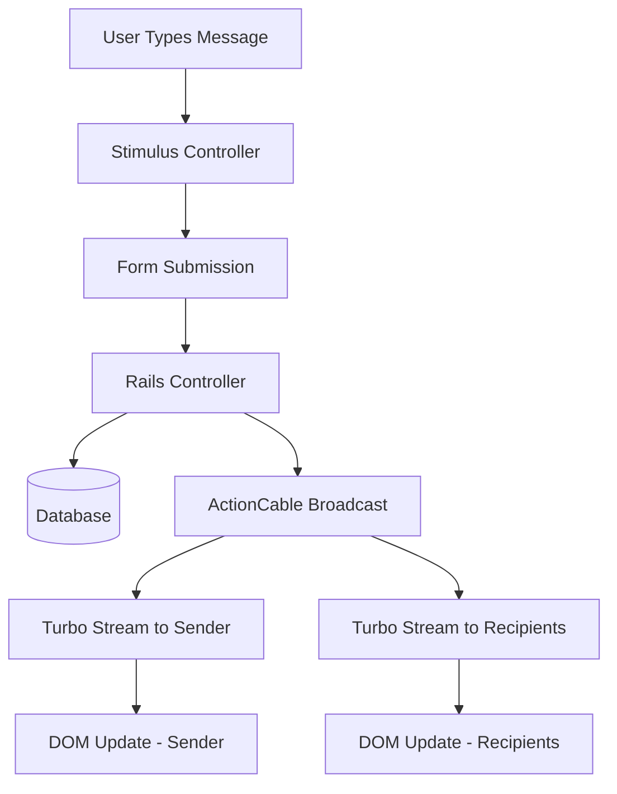
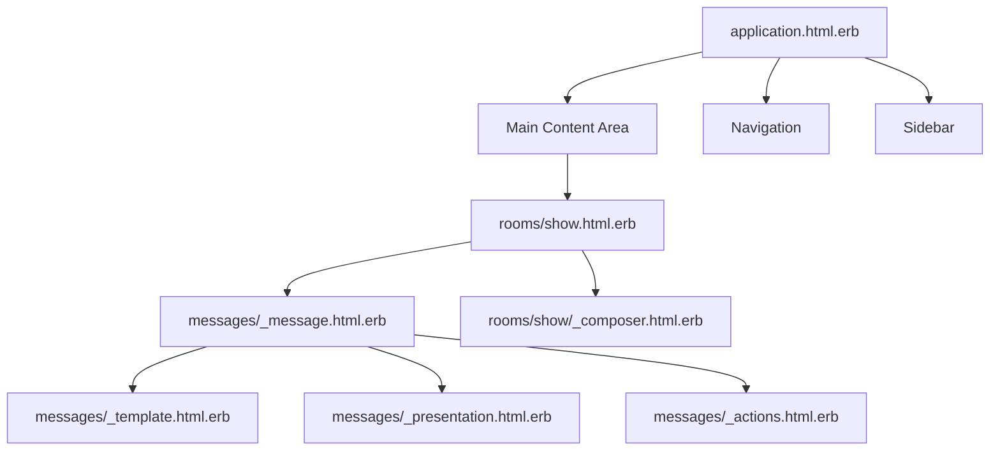
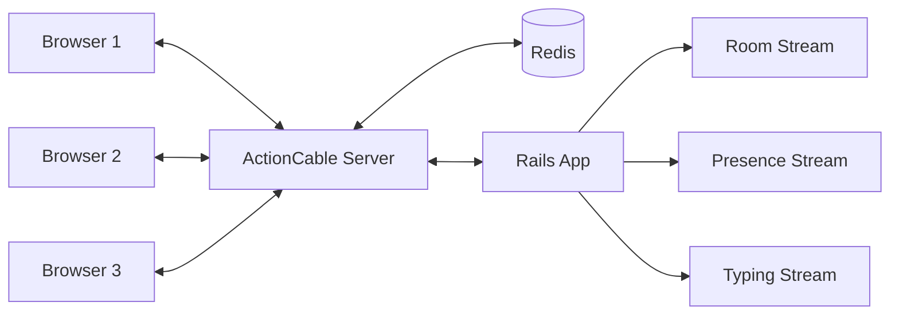

# Frontend Architecture of Campfire

## Introduction

Campfire's frontend represents a modern take on server-driven interactivity, blending the simplicity of traditional server-rendered applications with the responsiveness users expect from contemporary web apps. Unlike many chat applications that lean heavily on JavaScript frameworks, Campfire takes a fundamentally different approach: it treats the server as the source of truth and uses Hotwire (Turbo + Stimulus) to orchestrate interactive experiences without sacrificing the benefits of server-side rendering.

This architectural choice isn't just about technology preference—it's about reducing complexity while maintaining capability. By leveraging Rails' mature ecosystem and augmenting it with targeted JavaScript enhancements, Campfire achieves real-time chat functionality without the overhead of managing a separate frontend application.

## The Hotwire Philosophy in Practice

### Why Server-Driven Architecture Makes Sense for Chat

Most modern chat applications ship massive JavaScript bundles to recreate application state in the browser. Campfire inverts this model. The server remains the authoritative source for all application state, and the browser acts as a thin presentation layer that responds to server-sent updates.

This approach yields several advantages:
- **Simplified state management**: No client-side store synchronization problems
- **Consistent rendering**: The same ERB templates render both initial page loads and updates
- **Reduced complexity**: No need for API versioning or client-server contract management
- **Better SEO and accessibility**: Full HTML responses work without JavaScript

### Turbo Streams: The Real-time Engine

At the heart of Campfire's real-time functionality lies Turbo Streams, which enables surgical DOM updates over WebSocket connections. Here's how a message flows through the system:



When a user sends a message, the `MessagesController` processes it and broadcasts a Turbo Stream update:

```ruby
# app/controllers/messages_controller.rb
def create
  @message = @room.messages.create_with_attachment!(message_params)
  @message.broadcast_create
  deliver_webhooks_to_bots
end
```

The `broadcast_create` method leverages Rails' built-in Turbo Stream helpers to send HTML fragments directly to connected clients. No JSON serialization, no client-side rendering—just HTML over the wire.

### Stimulus Controllers: Orchestrating Interactivity

While Turbo handles the heavy lifting of DOM updates, Stimulus controllers add the interactive polish that makes the application feel responsive. Campfire employs 38 Stimulus controllers, each with a specific responsibility. This modular approach keeps controllers focused and testable.

The `MessagesController` (the Stimulus one, not the Rails controller) exemplifies this pattern:

```javascript
// app/javascript/controllers/messages_controller.js
export default class extends Controller {
  static targets = [ "latest", "message", "body", "messages", "template" ]
  static values = { pageUrl: String }
  
  connect() {
    this.#clientMessage = new ClientMessage(this.templateTarget)
    this.#paginator = new MessagePaginator(this.messagesTarget, this.pageUrlValue)
    this.#scrollManager = new ScrollManager(this.messagesTarget)
    
    if (this.#hasSearchResult) {
      this.#highlightSearchResult()
    } else {
      this.#scrollManager.autoscroll(true)
    }
  }
}
```

This controller manages message display, pagination, scrolling, and search highlighting—all without directly manipulating message content. The server provides the content; Stimulus orchestrates its presentation.

## View Architecture and Organization

### The ERB Template Hierarchy

Campfire's view layer follows Rails conventions while introducing patterns specific to real-time applications. The hierarchy looks like this:



The application layout (`app/views/layouts/application.html.erb`) establishes the overall structure with designated regions for navigation, main content, and sidebar. Each region can be updated independently through Turbo Frames or Streams.

### Partial Design Patterns

Campfire's partials follow a clear naming convention that indicates their purpose:

- **Standard partials** (`_message.html.erb`): Reusable view components
- **Action partials** (`_actions.html.erb`): UI controls and interactive elements  
- **Template partials** (`_template.html.erb`): Client-side templates for optimistic UI updates
- **Presentation partials** (`_presentation.html.erb`): Read-only display formatting

This convention makes it immediately clear whether a partial is for display, interaction, or templating purposes.

### Turbo Frame Integration

Turbo Frames enable page sections to be lazily loaded and independently updated. The sidebar exemplifies this pattern:

```erb
<%# app/views/rooms/show.html.erb %>
<% content_for :sidebar, sidebar_turbo_frame_tag(src: user_sidebar_path) %>
```

This single line establishes a Turbo Frame that loads asynchronously, keeping the initial page load fast while fetching secondary content in the background.

## JavaScript Module Architecture

### Import Maps: The Build-Free Approach

Instead of webpack or other bundlers, Campfire uses Import Maps to manage JavaScript dependencies:

```ruby
# config/importmap.rb
pin "@hotwired/stimulus", to: "stimulus.min.js"
pin "@hotwired/turbo-rails", to: "turbo.js"
pin_all_from "app/javascript/controllers", under: "controllers"
pin_all_from "app/javascript/models", under: "models"
pin_all_from "app/javascript/helpers", under: "helpers"
```

This approach eliminates build steps during development and simplifies deployment. Modules are served directly by the Rails asset pipeline, with HTTP/2 multiplexing ensuring efficient delivery.

### Model Objects: Encapsulating Client-Side Logic

While Stimulus controllers handle DOM interactions, model objects encapsulate business logic:

```javascript
// app/javascript/models/message_formatter.js
export default class MessageFormatter {
  constructor(currentUserId, classes) {
    this.currentUserId = currentUserId
    this.classes = classes
  }
  
  format(element, style) {
    this.#addUserClasses(element)
    this.#addTimeClasses(element)
    this.#addThreadingClasses(element, style)
  }
}
```

These model objects maintain no DOM references, making them testable and reusable across different controllers.

### Helper Modules: Shared Utilities

Helper modules provide common functionality without the overhead of inheritance:

```javascript
// app/javascript/helpers/timing_helpers.js
export function nextEventLoopTick() {
  return new Promise(resolve => setTimeout(resolve, 0))
}

export function nextFrame() {
  return new Promise(resolve => requestAnimationFrame(resolve))
}
```

These focused utilities keep controllers lean and promote code reuse without creating deep dependency chains.

## CSS Architecture and Design System

### Component-Based CSS Organization

Campfire's stylesheets are organized by component rather than by CSS property type:

```
app/assets/stylesheets/
├── messages.css      # Message component styles
├── composer.css      # Message composer styles
├── sidebar.css       # Sidebar navigation styles
├── buttons.css       # Button components
├── inputs.css        # Form input styles
└── base.css          # Global defaults
```

Each file encapsulates all styles for a specific component, making it easy to understand and modify component appearance without hunting through multiple files.

### CSS Custom Properties for Theming

The application uses CSS custom properties extensively for theming and responsive design:

```css
/* app/assets/stylesheets/base.css */
:root {
  --font-family: -apple-system, BlinkMacSystemFont, Aptos, Roboto, "Segoe UI";
  --hover-color: var(--color-border-darker);
  --hover-size: 0.15em;
  --hover-filter: brightness(1);
}
```

This approach enables runtime theming without recompilation and supports both light and dark modes through media queries:

```html
<meta name="theme-color" content="#ffffff" media="(prefers-color-scheme: light)">
<meta name="theme-color" content="#000000" media="(prefers-color-scheme: dark)">
```

### Utility-First Where It Makes Sense

While not adopting a full utility-first framework, Campfire includes targeted utility classes for common patterns:

```css
/* app/assets/stylesheets/utilities.css */
.flex { display: flex; }
.align-center { align-items: center; }
.gap { gap: var(--spacing); }
.overflow-ellipsis { text-overflow: ellipsis; }
```

This hybrid approach balances component encapsulation with the flexibility to make quick adjustments without writing new CSS.

## Real-time Communication Flow

### ActionCable Integration

ActionCable provides the WebSocket infrastructure for real-time updates. The architecture follows a hub-and-spoke model:



Each room establishes its own channel subscription:

```ruby
# app/channels/room_channel.rb
class RoomChannel < ApplicationCable::Channel
  def subscribed
    if @room = find_room
      stream_for @room
    else
      reject
    end
  end
end
```

This ensures users only receive updates for rooms they have access to, maintaining security boundaries at the transport layer.

### Optimistic UI Updates

For better perceived performance, Campfire implements optimistic updates for message sending:

```javascript
// app/javascript/controllers/composer_controller.js
async #submitMessage() {
  const clientMessageId = this.#generateClientId()
  
  // Immediately show the message
  await this.messagesOutlet.insertPendingMessage(clientMessageId, this.textTarget)
  
  // Then submit to server
  this.element.requestSubmit()
}
```

The message appears instantly in the sender's view, then gets replaced with the server-rendered version once the response arrives. If the request fails, the optimistic update is marked as failed, maintaining UI consistency.

### Presence and Typing Indicators

Real-time presence and typing indicators use dedicated ActionCable channels:

```ruby
# app/channels/typing_notifications_channel.rb
class TypingNotificationsChannel < ApplicationCable::Channel
  def typing(data)
    broadcast_to @room, typing_notification(data["typing"])
  end
end
```

These ephemeral updates bypass the database entirely, flowing directly through Redis pub/sub for minimal latency.

## Performance Considerations

### Lazy Loading and Pagination

Messages load progressively as users scroll, preventing memory issues in long-running conversations:

```javascript
// app/javascript/models/message_paginator.js
export default class MessagePaginator {
  monitor() {
    this.observer = new IntersectionObserver(this.#handleIntersection.bind(this))
    this.observer.observe(this.sentinel)
  }
  
  async #loadPreviousPage() {
    const response = await fetch(this.previousPageUrl)
    const html = await response.text()
    this.#insertMessages(html)
  }
}
```

This approach loads messages on demand, keeping initial page loads fast and memory usage reasonable.

### Asset Delivery Optimization

Import Maps combined with HTTP/2 push enable efficient module delivery:

1. Browser requests initial page
2. Server responds with HTML and pushes critical JavaScript modules
3. Subsequent modules load on demand with browser caching
4. No bundling means granular cache invalidation

### Minimal JavaScript Footprint

By embracing server-side rendering and limiting JavaScript to enhancement rather than rendering, Campfire achieves:
- Initial JavaScript payload under 100KB (compressed)
- No framework overhead (no React/Vue/Angular)
- Minimal runtime memory usage
- Fast time-to-interactive

## Overview and Critical Analysis

### Strengths of the Current Architecture

Campfire's frontend architecture excels in several areas:

1. **Simplicity through convention**: By following Rails conventions and using Hotwire, the architecture remains approachable for Rails developers without requiring deep JavaScript framework knowledge.

2. **Performance without complexity**: The server-driven approach delivers excellent performance without the complexity of client-side state management or API versioning.

3. **Progressive enhancement**: The application works without JavaScript (albeit with reduced functionality), ensuring accessibility and resilience.

4. **Maintainability**: With 38 focused Stimulus controllers rather than a monolithic JavaScript application, individual features can be modified without risk to the whole system.

### Areas for Improvement

While the architecture is solid, several areas could benefit from enhancement:

1. **Offline capability**: The server-driven model means the application requires constant connectivity. Implementing service workers for offline message queueing would improve reliability in poor network conditions.

2. **Search functionality**: Current search appears to be server-side only. Client-side fuzzy search through recent messages could provide instant results for common queries.

3. **Rich text editor performance**: The Trix editor, while functional, feels sluggish compared to modern alternatives like Lexical or ProseMirror. The editing experience could be more responsive.

4. **Mobile gesture support**: The touch event handling is basic. Implementing swipe gestures for navigation and message actions would improve the mobile experience significantly.

5. **Component extraction**: Some Stimulus controllers exceed 150 lines, suggesting they're handling multiple responsibilities. Further decomposition could improve testability and reusability.

6. **TypeScript adoption**: While the current JavaScript is clean, TypeScript would catch errors earlier and improve IDE support, especially as the codebase grows.

7. **CSS architecture scaling**: The component-based CSS organization works well now, but might benefit from CSS Modules or CSS-in-JS as the design system expands to prevent naming collisions.

### Conclusion

Campfire's frontend architecture demonstrates that modern, real-time applications don't require complex JavaScript frameworks. By leveraging Hotwire and embracing server-side rendering, it achieves impressive functionality with minimal complexity. The architecture's strengths—simplicity, performance, and maintainability—far outweigh its limitations, most of which could be addressed incrementally without fundamental restructuring.

The key insight is that by keeping the server as the source of truth and using JavaScript for enhancement rather than rendering, Campfire sidesteps many of the complexities that plague modern SPAs while delivering a user experience that feels just as responsive.